# Moxie UI 重构方案（v2.0 · Typora 气质）

> 版本基准：v1.0.0 + 已落地的 v1.1 精修 · 撰写日期：2026-09-11
> 适用范围：`src/styles/*`、`src/components/*`、`src/editor/extensions.ts`、`src/preview/markdown.ts` 的视觉与骨架重构
> 与 `docs/UI精修方案.md`（v1.1）的关系：v1.1 在**既有骨架与色相内**做精修，已全部落地；本方案**动骨架、动视觉语言**，目标是把 Moxie 从"规整的工具"变成"安静的写作空间"。

---

## 0. TL;DR

**现状一句话**：代码层面 Moxie 的 UI 已经相当规整（令牌、原语、三态都成体系），但观感上仍"灰、挤、碎"——三层 chrome 占掉默认窗口 15% 的高度，三种近白底色撑不起层次，控件尺寸有六档高度、七档图标，编辑器字号比预览大 20%，浅色主题有 4 处文字对比度不达 AA。

**方案一句话**：以 Typora 的"内容优先、chrome 极简、排版主导"为气质目标，做四件事——**合并骨架**（顶栏与标签栏一体，竖直 chrome 从 102px 减到 66px）、**重建灰度层次**（去线化，用底色差 + 微阴影代替 1px 实线）、**统一控件语言**（高度 3 档、图标 3 档、圆角按角色）、**让排版成为主角**（源码与渲染同字号同行距，切换不跳）。

**预期效果**：同样的功能与交互，默认窗口下正文可视面积增加约 5%，界面从"五条灰线分四块"变成"一片安静的内容 + 一条极简顶栏"。

---

## 1. 现状证据

### 1.1 截图索引（18 张，`docs/ui-redesign/`）

| 文件 | 界面 | 用途 |
|---|---|---|
| `01-empty-light.png` | 空状态（首启） | 97% 纯白，仅一个按钮 + 三行提示 |
| `02-main-render-light.png` | 主窗口 · 渲染模式 | 默认观感基线 |
| `03-tooltip-light.png` | 主窗口 · Tooltip | 浮层样式 |
| `04-code-light.png` | 主窗口 · 代码文件 | 语法高亮与行号 |
| `05-largefile-menu-light.png` | 大文件模式弹层 | 弹出菜单 |
| `06-saveprompt-light.png` | 保存确认对话框 | 模态与遮罩 |
| `07-md-source-light.png` | 主窗口 · 源码模式 | 源码态排版 |
| `08-tab-menu-light.png` | 标签右键菜单 | 菜单密度 |
| `09-toolbar-menu-light.png` | 语言菜单 | 菜单与勾选态 |
| `10-find-light.png` | 查找替换窗口 | 独立窗口 |
| `11-settings-light.png` | 设置窗口 | 独立窗口、控件密集 |
| `12-codec-light.png` | 编码转换窗口 | 独立窗口、双栏 |
| `13–18-*-dark.png` | 上述关键界面的深色对照 | 深色主题 |

**关键四张**（完整 18 张见文末附录）：

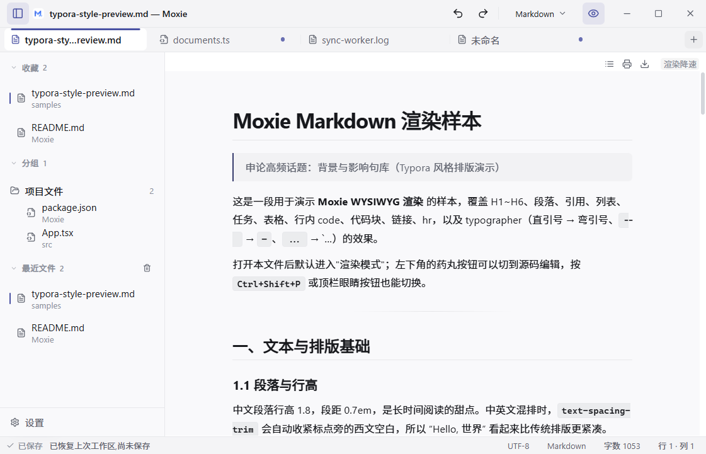
*主窗口 · 渲染模式（默认态）：竖直 chrome 占 102px，标签选中指示条为整条 accent 色块*

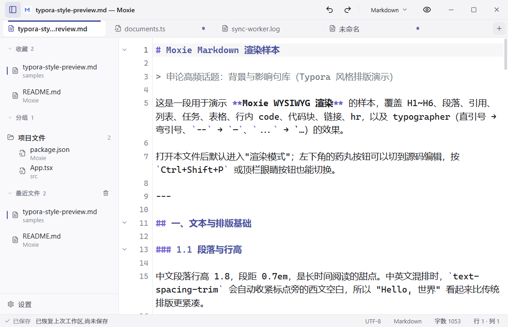
*主窗口 · 源码模式：18px/1.5 的编辑排版与渲染态 15px/1.8 不一致，切换有跳跃*

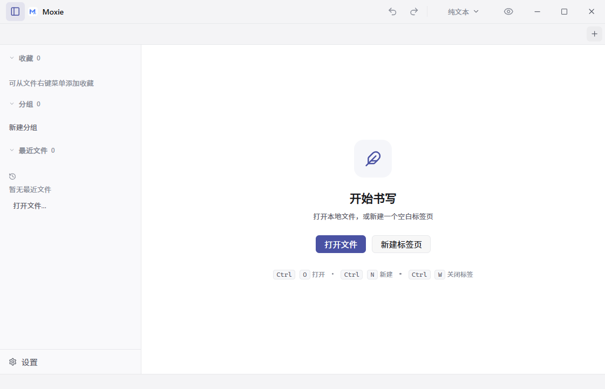
*空状态（首启）：97% 纯白，只有一个主按钮，无最近文件*

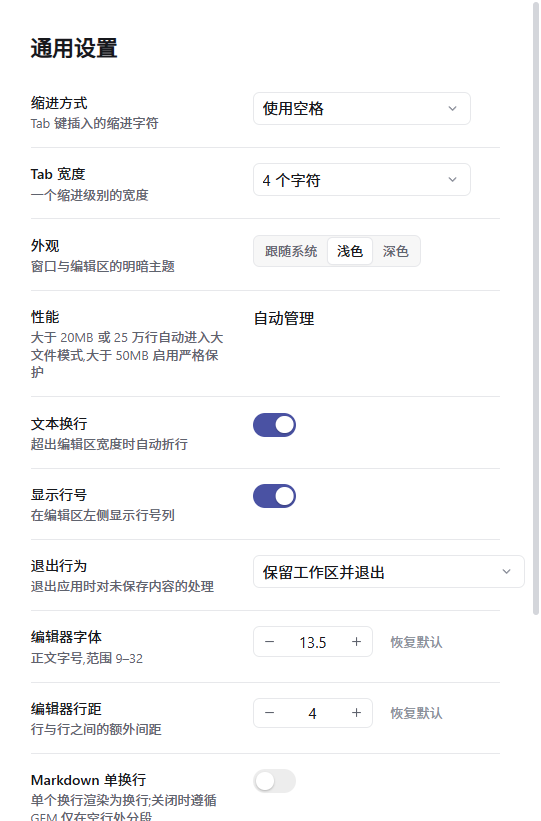
*设置窗口：标题 20px、行高 65px，与主窗口 32px 控件不是一套刻度*

### 1.2 实测数据（CDP 采集真实计算样式，`measure-light.json` / `measure-dark.json`）

**默认窗口**：1120×720 物理 px → 视口 **1028×661** CSS px（dpr 1.09）。

**竖直骨架**（占视口高度）：

| 区域 | 现状 | 占比 |
|---|---|---|
| 标题栏 `.title-toolbar` | 40px | 6.1% |
| 标签栏 `.tab-bar` | 36px | 5.4% |
| 状态栏 `.status-bar` | 26px | 3.9% |
| **合计 chrome** | **102px** | **15.4%** |

**水平**：侧栏固定 240px，占视口宽度 23.3%。

**控件尺寸离散**（同一套 UI 里出现的实际值）：

| 元素 | 实测 |
|---|---|
| 预览工具按钮 `.preview-outline-trigger` | 22×22 |
| 分段控件内按钮 `.segmented button` | 24px |
| 标签新建按钮 `.tab-new-button` | 26×26 |
| 步进器 `.stepper` | 28px |
| 输入框/查找按钮/对话框按钮 | 30px（`--control-h`） |
| 工具栏按钮 `.tool-button` / 标签 `.tab` | 32×32 / 32px |
| 图标尺寸（lucide `size`） | **11 / 12 / 13 / 14 / 15 / 18 / 28** 七档 + CSS 覆盖 17px |

**圆角离散**：4 / 5 / 6 / 8 / 10 / 16 / 999（另有 1px、2px 各一处）。

**排版对照**：

| 位置 | 字号 / 行高 |
|---|---|
| 源码模式编辑器 | **18px / 26.9px（1.50）** |
| 渲染预览正文 | **15px / 27px（1.80）** |
| 标签名 | 14px（与 UI 正文同大） |
| 状态栏 | 12px |

→ 同一篇文档在"源码 ↔ 渲染"切换时字号跳 20%、行距跳 20%。

**浅色主题对比度不达标**（WCAG AA 小号文字要求 ≥ 4.5:1）：

| 位置 | 对比度 |
|---|---|
| 状态栏"已保存" `.save-state` | **2.94** |
| 侧栏行副标题 `.row-subtitle` | **3.08** |
| 侧栏区块标题 `.section-title` | **3.08** |
| 浮动模式切换药丸 `.view-mode-toggle` | **3.48** |

（深色主题最低 4.77，全部达标——问题集中在浅色的三级灰 `#8b8f9a`。）

### 1.3 代码定位

| 问题 | 位置 |
|---|---|
| 骨架三行高度 | `tokens.css:146-148`；`.title-toolbar` `app.css:162`、`.tab-bar` `app.css:351`、`.status-bar` `app.css:287` |
| 三层底色几乎同色 | `tokens.css:8-11`（`#f4f4f6` / `#f9f9fb` / `#ffffff` / `#f6f7f9`） |
| 三条水平分隔线 | `app.css:171`（顶栏底）、`app.css:357`（标签栏底）、`app.css:299`（状态栏顶） |
| 控件尺寸 | `app.css:237-245`（`.tool-button` 32 + svg 17）、`app.css:387-390`（`.tab` 32）、`app.css:1298`（`.tab-new-button` 26） |
| 标签强调条过量 | `app.css:409-423`（`.tab::after` 2.5px × `calc(100% - 20px)` 的 accent 实心条） |
| 编辑器字号 | `extensions.ts` 的 `EditorView.theme` + `preferences.ts:80`（默认 13.5pt → 18px） |
| 预览字号 | `preview/markdown.ts` 的 `renderShell`（body 15px / article `min(72ch, 100%)`） |
| 空状态 | `EditorEmptyState.tsx`（仅标题 + 描述 + 两个按钮 + 提示行） |

---

## 2. 诊断：为什么"规整"却"不好看"

**D1 · 骨架太重，chrome 与内容争夺注意力。**
40 + 36 + 26 三行共 102px，且每行都有 1px 实线：视觉上窗口被切成"四块灰条 + 一块内容"。对照 Typora：只有一条顶栏（约 30px，含菜单），状态栏默认极简，标签栏根本不存在——屏幕几乎全部给正文。Moxie 需要多标签，但**不需要三行**。

**D2 · 层次靠线，不靠明度。**
三种近白（`#f4f4f6` / `#f9f9fb` / `#ffffff`）明度差只有 2–4%，肉眼几乎无法区分"这是 chrome"还是"这是内容"；于是每一块都得再加一条 1px 边线来界定，形成"灰蒙蒙 + 到处是线"的观感。

**D3 · 控件语言没有刻度。**
高度 22/24/26/28/30/32 六档、图标 11–28 七档、圆角四档混用。单个控件看都合理，放在一起就"碎"——这是"看起来不专业"最直接的来源。

**D4 · 排版不是主角，反而被 chrome 压住。**
编辑器 18px/1.5 与预览 15px/1.8 是两套排版；UI 里标签名 14px 与正文字号同级；状态栏 12px 挤在 26px 高里。内容没有"被精心排过"的感觉，chrome 反而更抢眼。

**D5 · 强调色用量两极分化。**
`--lac-accent` 在 `app.css` 出现 19 次，其中标签选中指示条是 **2.5px × 188px 的实心色块**，激活按钮是整块 soft 底；但真正需要引导的地方（当前模式、焦点层级）反而不明显。结果是"该亮的地方不亮，不该亮的地方一片紫"。

**D6 · 浅色主题的可读性欠账。**
三级灰 `#8b8f9a` 在浅底上只有 3.08:1，直接被用在"已保存"、副标题、区块标题这些需要阅读的文字上。深色主题没有这个问题（4.77:1），说明这不是审美问题而是**浅色令牌取值问题**。

**D7 · 顶栏与标签栏信息重复。**
顶栏显示"文件名 — Moxie"，标签栏也显示文件名；顶栏放的是"对当前文档的动作"（撤销/重做/语言/视图），标签栏放的是"文档集合"。两行其实可以做成一行的两个语义区。

**D8 · 独立窗口与主窗口不是一套语言。**
设置窗口标题 20px（主窗口 UI 最大 14px）；设置行高 65px（侧栏行 36px）；开关 40×22 而复选框 15×15；编解码文本域 12px 而编辑器 18px。四个窗口像四个产品。

**D9 · 空状态没有信息量。**
首启画面 97% 是白色，只有一个主按钮。Typora 在这里给"最近文件"，Moxie 却让用户面对一片空白——第一印象损失最大的地方。

---

## 3. 设计方向：Typora 气质

### 3.1 Typora 做对了什么（可迁移的部分）

| Typora 的做法 | 迁移到 Moxie |
|---|---|
| 常驻 chrome 只有一条顶栏，其余全给正文 | 顶栏与标签栏合并为一行；状态栏减薄 |
| 界面无彩色，强调色只出现在内容与选区 | chrome 中性化，accent 收敛到 4 个场景 |
| 打开时给"最近文件"列表 | 空状态改为欢迎页 + 最近文件 |
| 正文排版是产品核心，字号行高可选可存 | 源码与渲染同字号同行距；编辑器排版参数进设置 |
| 极少边框，用留白与底色差分层 | 三层底色拉开明度差，删除重复的 1px 线 |
| 浮动小控件（源码模式切换） | 保留药丸按钮，但改为低对比"浮标"样式 |
| 主题即 CSS 变量 | 保持 `--lac-*` 令牌体系，为将来换肤留口 |

### 3.2 五条重构原则

1. **内容优先**：任何常驻 UI 都要能回答"它是否在帮用户读写内容"；不能的，默认隐藏或减薄。
2. **一度灰**：同一层级只允许一种中性色；层次靠**明度差 ≥ 4%** 与留白，而不是靠加线。
3. **刻度化**：尺寸只有 3 档（紧凑 24 / 标准 28 / 强调 32），图标只有 3 档（12 / 14 / 16），圆角按角色而非手感。
4. **彩色稀缺**：chrome 里 accent 只允许出现在「焦点环、主按钮、当前标签指示、激活图标」四处；其余一律中性。
5. **同源排版**：源码、渲染、导出三处的字号/行距/行宽同源，切换不产生视觉跳跃。

### 3.3 不可妥协（Moxie 的产品边界）

- 多标签、多窗口、标签右键菜单、拖拽排序——**保留**，不做 Typora 式的"无标签"。
- 大文件分级降级、编码转换、恢复机制——视觉重构不得改变其行为与信息。
- 不引入任何新依赖（沿用 lucide-react + 纯 CSS）。
- 深浅两套必须成对改；组件里不允许出现裸色值（`#c42b1c` 系统红除外）。

---

## 4. 设计系统 v3（`tokens.css` 重构）

### 4.1 色彩：中性阶 + 稀缺强调

**浅色**

| 角色 | 现状 | 建议 | 说明 |
|---|---|---|---|
| 窗口/侧栏底 `--bg-canvas` | `#f9f9fb` | `#f4f4f5` | 与外层形成明确"底" |
| chrome（顶栏/状态栏）`--bg-chrome` | `#f4f4f6` | `#ececee` | 比 canvas 深 4%，chrome 有存在感 |
| 内容面 `--bg-surface` | `#ffffff` | `#ffffff` | 编辑器/预览/卡片 |
| 内嵌面 `--bg-inset` | `#f6f7f9` | `#f3f3f5` | 输入域/代码块 |
| 悬停/按下 | 4.5% / 9% | 5% / 10% | 不变 |
| 主文本 `--text` | `#17181c` | `#1a1b1f` | |
| 次文本 `--text-secondary` | `#5f636e` | `#5c6068` | 5.4:1，达标 |
| 三级文本 `--text-tertiary` | `#8b8f9a` | **`#74777f`** | **3.08 → 4.6:1，修 D6** |
| 分隔线 `--border` | `#e7e8eb` | `#e4e5e8` | 只在必要时出现 |
| 强调 `--accent` | `#4a52a3` | 不变 | 与"安静"气质匹配 |

**深色**（仅微调，去掉多余的蓝味；其余不动）

| 角色 | 现状 | 建议 |
|---|---|---|
| chrome | `#17181b` | `#141416` |
| canvas | `#1a1b1f` | `#171719` |
| surface | `#1d1e22` | `#1c1c1f` |
| elevated | `#25262b` | `#242428` |
| 三级文本 | `#83878f` | 不变（4.77:1 已达标） |

### 4.2 排版：两条轨道

**UI 轨道**（13px 基准，向下取 12、向上取 14）

| 令牌 | 值 | 用途 |
|---|---|---|
| `--fs-meta` | 11px | 徽标 / kbd |
| `--fs-caption` | 12px | 状态栏 / 描述文字 / 菜单快捷键 |
| `--fs-ui` | **13px** | 标签名 / 菜单项 / 按钮 / 输入 / 侧栏行（现状 14 → 13） |
| `--fs-title` | 14px | 对话框标题 / 设置分组标题 600 字重 |

**内容轨道**（16px 基准，由偏好换算覆盖）

| 令牌 | 值 | 用途 |
|---|---|---|
| `--fs-content` | **16px** | 预览正文 与 源码模式正文字号 |
| `--fs-content-line` | 1.75 | 两者统一行距（预览沿用 1.8 亦可，但必须相同） |
| `--fs-mono` | 13.5px | 代码文件 / 代码块（等宽视觉偏大，降半档） |
| `--measure` | `min(74ch, 100%)` | 正文行宽（预览已用 72ch，源码模式建议同步） |

> 编辑器偏好 `fontSizePt` 默认值从 13.5pt（=18px）改为 **12pt（=16px）**，与预览一致；设置页滑块范围不变。

### 4.3 骨架尺寸

| 令牌 | 现状 | 建议（方案 A） | 建议（方案 B 回退） |
|---|---|---|---|
| `--h-header`（顶栏+标签一体） | 40 + 36 | **44px** | 36 + 30 |
| `--h-statusbar` | 26px | **22px** | 22px |
| `--w-sidebar` | 240px | **232px** | 232px |
| `--h-sidebar-row` | 36px | **32px** | 32px |
| `--h-section-header` | 25px | **28px** | 28px |

竖直 chrome：102px → **66px**（内容可视高度 +5.4%）。

### 4.4 控件三档

| 档位 | 高度 | 图标 | 场景 |
|---|---|---|---|
| `--ctl-sm` | 24px | 12–14px | 预览工具条、标签关闭、状态栏 chip、对话框小动作 |
| `--ctl-md` | **28px** | 16px | 工具栏按钮、输入域、下拉、次按钮、菜单行 |
| `--ctl-lg` | 32px | 16px | 对话框主按钮、空状态按钮、设置页大控件 |

圆角按角色：内嵌元素 4px（checkbox/kbd）→ 控件与输入 6px → 浮层/卡片 8px → 对话框 12px → 胶囊 999px。清除 1/2/5/10/16 的散值。

阴影去"描边感"：浮层从 `0 0 0 1px var(--border) + blur` 改为 **1px 半透明描边（`rgba(0,0,0,.06)`）+ 柔和投影**；模态 `--sh-3` 的 64px 扩散收紧到 40px。

### 4.5 动效

沿用 80 / 140 / 220ms 三档，新增两处结构性动效：

- 源码 ↔ 渲染切换：160ms 交叉淡入（当前是硬切）。
- 侧栏自动隐藏/唤出：180ms `translateX(-8px) + opacity`。

---

## 5. 骨架重构

### 5.1 方案 A（推荐）：顶栏与标签栏合并为 44px 单行

```
现状 ── 三行 102px
┌─────────────────────────────────────────────────────────────────────────┐
│ [▤] ◆ Moxie — 提案.md            ⟲ ⟳ │ 语言 ▾ │ 👁 │        ─ □ ✕      │ 40
├─────────────────────────────────────────────────────────────────────────┤
│ [▣ 提案.md ×][▣ documents.ts][▣ 日志] +                                 │ 36
├─────────────────────────────────────────────────────────────────────────┤
│ 内容 …                                                                   │
├─────────────────────────────────────────────────────────────────────────┤
│ ✓已保存  ⏱大文件模式   message        行 1 · 列 1 | UTF-8 | Markdown | 字数 1053 │ 26
└─────────────────────────────────────────────────────────────────────────┘

方案 A ── 一行 44px
┌─────────────────────────────────────────────────────────────────────────┐
│ [▤] [▣ 提案.md ×][▣ documents.ts][▣ 日志] +          ⟲ ⟳ 语言▾ 👁    ─ □ ✕ │ 44
├─────────────────────────────────────────────────────────────────────────┤
│ 内容 …                                                                   │
├─────────────────────────────────────────────────────────────────────────┤
│ ●未保存                                   行 1 · 列 1 · UTF-8 · 字数 1053 │ 22
└─────────────────────────────────────────────────────────────────────────┘
```

要点：

1. **文档名只出现一次**（在标签上）。窗口标题仍通过 `getCurrentWindow().setTitle()` 维护，任务栏/Alt-Tab 不受影响。
2. **标签条在左、动作在右**：标签区 `flex: 0 1 auto` 可横向滚动，中间留 `spacer` 作为拖拽区。
3. **拖拽区实现**：`data-tauri-drag-region` 只加在顶栏容器与 `spacer` 上，**不加在标签容器上**；标签的 `mousedown` 自然阻止窗口拖拽，排序拖拽不受影响。
4. **标签样式重做**：高度 30px、圆角 6px、字号 13px、最大宽度 176px；选中态 = `surface` 底 + 顶部 2px accent 短条（宽度收窄到 40%，居中）；未选中 = 透明底、悬停 5% 底、彩色图标降为中性。
5. **品牌标识与"文件名 — Moxie"文案移除**；品牌只在空状态出现（减少 chrome 噪音）。
6. **窗控按钮保持 46px**（Windows 规范），悬停语义色不动。

**风险与回退**：合并后若实机出现"窗口无法拖动"或"标签拖拽排序与窗口拖拽冲突"，直接回退方案 B（保留两行，尺寸减薄 + 顶栏去掉文档名），所有令牌与组件样式不变。

### 5.2 方案 B（保守回退）：两行减薄

- 顶栏 40 → 36px，去掉 `title-brand` 与 `window-title`（文档名交给标签），只留侧栏开关 + 居中拖拽区 + 文档动作 + 窗控。
- 标签栏 36 → 30px，标签 32 → 26px。
- chrome 合计 102 → 88px（比方案 A 多 22px 的标签行，但改动面小、风险最低），所有令牌与组件样式与方案 A 共用。

### 5.3 侧栏

- 宽度 240 → 232px；行高 36 → 32px，副标题与标题间距收紧 2px。
- 删除右侧 1px 实线，改用 `canvas` 与 `surface` 的明度差（浅色下已经差 4%，足够）。
- 区块标题 `.section-title` 用 `--text-tertiary` 修正后的新值（4.6:1），字重 600 → 500，字距 0.02em。
- 区块间距 10 → 16px，滚动区 padding 8 → 12px。
- 底部设置入口保持（36 → 32px 行高）。

### 5.4 状态栏

- 26 → 22px；字号 12px；颜色统一 `--text-secondary`，仅"未保存"用 `--warning`。
- **"已保存"常驻文案取消**：仅脏时显示"● 未保存"；保存成功后短暂显示"✓ 已保存"1.6s 后淡出（减少 90% 时间的无效信息）。
- 右侧信息合并为一条，用 `·` 分隔：`行 1 · 列 1 · UTF-8 · Markdown · 字数 1053`；大文件降级时在最左插入一枚 `warning-soft` 底的胶囊（替换现在的纯文字按钮）。
- 去掉上边框，用 `chrome` 底色与内容面区分。

---

## 6. 分区重构细则

> 每节按「改动 → 验收」组织。所有数值引用 §4 令牌。

### 6.1 顶栏 + 标签（核心改动）

- 标签：`height: 30px`、`border-radius: 6px`、字号 `--fs-ui`、选中底 `--bg-surface`、未选中悬停 `--lac-hover`；**删除整条 accent 指示条**，改为选中标签顶部 2px × 40% 宽的圆头短条。
- 布局：`padding: 0 8px`；标签间距 6px；标签内 left 图标 14px、右侧关闭按钮 20×20（悬停才出现，保持现状逻辑）。
- 动作区：撤销/重做/语言/视图四个按钮统一 28×28、图标 16px；语言按钮去掉 112px 固定最小宽度，改为内容自适应（`min-width: auto`）+ 8px 内边距。
- 窗控：46px 宽不变。

**验收**：4 个标签 + 动作区在 1028px 视口下全部可见不换行；窗口可从标签右侧空白拖动；标签拖拽排序正常；切换标签无 layout shift。

### 6.2 编辑器（源码模式）

- 字号 18 → **16px**（与预览一致），行高 1.5 → **1.75**，`padding: 16px 0 32px`。
- markdown 文件在源码模式下加内容宽度限制：`.cm-content { max-width: 74ch; margin: 0 auto; }`（仅 markdown；代码文件保持全宽）。
- 行号：`--text-tertiary`（新值）、等宽、`min-width: 40px`。
- 当前行高亮 4% → 3.5%（更轻）；选区 opacity 22% → 18%；查找高亮保持橙色系不动。
- 光标 2px accent；括号匹配保持软底无描边。

**验收**：同一篇 md 在源码/渲染间切换，正文字号与行距观感一致（截图叠对）；代码文件仍全宽且等宽字号 13.5px。

### 6.3 渲染模式（预览）

- 正文 15 → 16px，段距 0.7em → 0.8em，行宽 72ch → 74ch，`article` 上下留白 40 → 48px。
- H1 2em → 1.75em（现在 30px 在 16px 正文下偏大），H2 1.5 → 1.35em，标题字重 700 → 650。
- 代码块：圆角 8px、内边距 14/16、去掉 1px 边框改为纯底色；行内代码去边框只留底色。
- 引用块：左条 2.5px → 3px，颜色改为 `--lac-border-strong`（中性化，去掉 accent 混色）。
- 表格：表头底 4% → 3%，表头下边线加深半档。
- 浮动药丸按钮：改为"浮标"样式——无边框、无阴影、文字 `--text-tertiary`，悬停才浮出底色与 `--text-secondary`（当前 3.48:1 且带阴影，像贴纸）。

**验收**：1200 字中文长文在默认窗口滚动阅读无压迫感；行内代码/引用/表格三种"块"一眼可辨；药丸不再抢视线。

### 6.4 对话框 / 菜单 / Tooltip

- 遮罩：浅色 `rgba(20,22,28,.42)` → `.32`；深色 `.6` → `.5`。
- 面板：圆角 8 → 12px，内边距 24px，标题 14px/600，消息 13px/1.65，按钮右对齐 gap 8px，主按钮 32px 高。
- 菜单：行高 30 → 28px，字号 13px，快捷键右侧 `--text-tertiary` 12px；选中项底 `--lac-accent-softer`；删除菜单容器的 1px 边框改用 §4.4 的新阴影。
- Tooltip：12px、`--bg-elevated`、圆角 6px、延迟保持 600ms。

**验收**：五个对话框（保存/编码/冲突/有损/输入）结构一致；深浅两套下遮罩与面板对比正确；菜单在两种主题下都不"发灰"。

### 6.5 空状态（改为欢迎页）

```
┌──────────────────────────────────────────────┐
│                                              │
│                    ◆                         │
│                  Moxie                       │
│          安静、快速、本地优先的书写工具          │
│                                              │
│         [ 新建文件 ]   [ 打开文件 ]            │
│                                              │
│   最近                                          │
│   ▸ typora-style-preview.md      2 分钟前      │
│   ▸ README.md                    昨天          │
│                                              │
│   提示：Ctrl+N 新建 · Ctrl+O 打开 · 拖入文件    │
└──────────────────────────────────────────────┘
```

- 品牌标识 40px（复用 `src-tauri/icons/128x128.png`），标题 20px/600，副标题 13px。
- 最近文件取 `recent_list` 前 5 条，行高 34px，悬停 5% 底；无最近文件时整块隐藏。
- 快捷键提示行降为 `--text-tertiary` 12px。

**验收**：首启不再是一片空白；点击最近文件可打开；无最近记录时布局不塌。

### 6.6 设置窗口

- 标题 20 → 16px；分组标题 12px/600/tertiary；描述 12px。
- 行高 65 → 56px；行间分隔线保留但降为 `--border`（已是）。
- 开关 40×22 → 32×18（圆角 999，滑块 14px）；与全局 checkbox 15px 形成"大/小"两档而非两套语言。
- 分段控件 30 → 28px 高，内部按钮 24 → 22px。
- 底部加版本号 + "Moxie 1.0.0"（`--fs-caption`，tertiary）。

**验收**：窗口在 496px 宽下无横向滚动；深浅两套下控件一致；键盘遍历顺序不变。

### 6.7 查找替换 / 编解码窗口

- 查找：内边距 24 → 16px；输入与按钮 30 → 28px；结果计数靠右显示 `3/12`；`Aa`/`.*` 等复选项改为小号 icon-toggle（28×28）。
- 编解码：文本域 12 → 13.5px 等宽、行高 1.6；两栏分隔用 1px `--border`（保留，因为是并列信息区）；激活芯片用 `accent-softer` 底 + accent 文字（现状已是，统一尺寸到 24px）。

**验收**：两个窗口的控件高度与主窗口一致（28px 档）；中文与等宽文本都不折行错位。

---

## 7. 实施路线图

> 每阶段独立可交付、可回滚；改完跑 `npm test` + `npm run check`；每阶段结束用 `docs/ui-redesign/` 的采集脚本重拍截图对比。

| 阶段 | 内容 | 预计 | 验收 |
|---|---|---|---|
| **0 · 令牌与刻度** | `tokens.css` v3（色彩/字号/骨架/控件三档/圆角/阴影）；`--fs-content` 与 `--fs-mono` 落地；修正三级灰对比度 | 0.5 天 | 深浅两套截图对比；4 处对比度全部 ≥ 4.5:1 |
| **1 · 骨架合并** | 方案 A（顶栏 + 标签一体 44px）或回退方案 B；状态栏 26 → 22px 与"已保存"降噪 | 1.5 天 | 窗口拖动、标签排序、多标签溢出、窗控全部正常；chrome 高度实测 ≤ 66px |
| **2 · 侧栏与空状态** | 侧栏尺寸/去线/间距；空状态改欢迎页（含最近文件） | 1 天 | 侧栏行高 32px；首启有最近文件可点 |
| **3 · 内容排版** | 编辑器 16px/1.75 与预览同步；预览标题/代码块/引用/表格微调；药丸浮标化 | 1 天 | 同一文档源码/渲染切换截图叠对，无字号跳跃 |
| **4 · 独立窗口与浮层** | 设置/查找/编解码统一控件刻度；对话框/菜单/Tooltip 阴影与圆角 | 1 天 | 四窗口控件高度只剩 24/28/32 三档 |
| **5 · 走查与基线** | 浅深 × 全场景重拍，替换 `docs/ui-redesign/` 基线；键盘焦点环抽查 | 0.5 天 | 19 张新截图归档；`npm test`/`check`/`cargo test` 全绿 |

---

## 8. 不变量与风险

**必须保持不变**

1. **`.cm-doc-hidden` 的 `!important` 规则**（`app.css:1445`）：CodeMirror 基础主题对 `.cm-editor` 声明 `display: flex !important`，任何"用行内样式隐藏视图"的改动都会导致多标签纵向堆叠；回归测试在 `tests/editorVisibility.test.ts`。
2. **交互行为零变更**：焦点陷阱、Esc 关闭、标签拖拽排序、恢复快照、外部修改冲突检测、渲染/源码切换与滚动同步。
3. **IPC 与错误码契约**：本方案不触碰 `actions.ts` 的错误码匹配与 Rust 命令；仅改渲染层。
4. **CSP 不变**：预览 iframe 与 select 箭头的内联样式都在 `style-src 'unsafe-inline'` 白名单内。
5. **大文件分级**：`standard/large/extreme` 的特性降级与状态栏提示逻辑不变，只改其视觉表达。
6. **深浅成对**：每处颜色改动同时落两套；组件内禁止裸色值（系统红 `#c42b1c` 除外）。

**主要风险**

| 风险 | 影响 | 对策 |
|---|---|---|
| 顶栏合并后窗口无法拖动 | 高 | 只给容器与 spacer 打 `data-tauri-drag-region`；实机用鼠标拖动验证（自动化无法覆盖） |
| 标签拖拽排序与窗口拖拽冲突 | 中 | 标签不标记拖拽区；阶段 1 实机验证；必要时回退方案 B |
| 编辑器字号 18 → 16 影响老用户习惯 | 低 | 偏好值仍可调；仅在默认值上变更，`hydrate` 保留用户已存值 |
| 浅色三级灰改深后"层次变糊" | 低 | 三级灰只用于文字；装饰性分隔继续用 `--border` |
| 状态栏"已保存"取消引起不安 | 低 | 保留 1.6s 成功提示与保存中的旋转态；设置项 `statusBarVisible` 仍可整体隐藏 |
| 长文档预览行宽 74ch 在窄窗口溢出 | 低 | 保持 `min(74ch, 100%)`，与现状同构 |

---

## 9. 不做什么

- ❌ 不做无标签/单文档模式（Moxie 的定位是多标签编辑器）。
- ❌ 不加渐变、毛玻璃、大面积彩色、圆角卡片流。
- ❌ 不引入组件库/Tailwind/CSS-in-JS；不引入图标库替换 lucide。
- ❌ 不做文件树（产品决策仍是"文件列表侧栏"）。
- ❌ 不动窗口控制按钮的 Windows 语义（46px、关闭悬停系统红）。
- ❌ 不为了"像 Typora"而删掉状态栏、编码指示、大文件模式等本地化能力；只做减法到"必要信息"。

---

## 10. 实施记录（阶段 0/1/2，2026-09-11）

### 阶段 0 + 阶段 1（已完成）

改动文件：`styles/tokens.css`（v3 全量）、`styles/app.css`（骨架/控件/状态栏/标签/侧栏规则）、`components/TitleToolbar.tsx`（新增 `children`，移除品牌点与文档标题）、`components/TabBar.tsx`（并入顶栏、宽度公式、拖拽区位置）、`components/StatusBar.tsx`（保存态降噪、信息分组）、`App.tsx`（标签栏作为顶栏子节点）。

**实测对照**（`measure-light.json` vs `verify-after-p0p1.json`，同一默认窗口 1028×661）：

| 指标 | 实施前 | 实施后 |
|---|---|---|
| 竖直 chrome | 102px（40 + 36 + 26） | **66px**（44 + 22） |
| 标签 | 32px 高 / 最宽 208px | 30px 高 / 99.8–176px（5 标签实测 99.8） |
| 工具栏按钮 | 32×32，图标 17px | 28×28，图标 16px |
| 预览工具按钮 | 22×22 | 24×24 |
| 侧栏 宽 / 行高 / 区块标题 | 240 / 36 / 25px | 232 / 32 / 28px，右边线移除 |
| 状态栏 | 26px，"已保存"常驻 | 22px，仅脏时"未保存"；保存后闪现"已保存"1.6s |
| 底色层次 | `#f4f4f6` / `#f9f9fb` / `#ffffff` | `#ececee` / `#f4f4f5` / `#ffffff` |
| 副标题 / 区块标题对比度 | 3.08 | **4.64** |
| 浮动药丸对比度 | 3.48 | **6.31** |
| 状态栏文字对比度 | 5.47 | **5.35**（底色变深后仍达标） |

**实施中发现并修复的缺陷**：`.tab-end-zone`（窗口拖拽区）原先位于 `.tab-scroll` 滚动容器**内部**——5 个标签时它被滚动裁掉、且与"撤销"按钮区域重叠（实测 681..705 落在标签栏 663 边界之外），导致拖拽区不可用。现已移出滚动容器、置于"+"按钮右侧，`min-width: 56px`；实测 603.9..663.3 完全落在标签栏内且无重叠。

**验收证据**：
- 几何与对比度：`docs/ui-redesign/verify-after-p0p1.json`、`tools/verify.mjs`、`tools/layout.mjs`
- 保存态流程实测：干净文档无提示 → 输入后"未保存" → `Ctrl+S` 后"已保存" → 1.8s 后消失，且磁盘文件确已写入
- 截图对照：`docs/ui-redesign/`（before，18 张）与 `docs/ui-redesign/after-p0p1/`（after，18 张）
- 拖拽区：Tauri `drag.js` 的判定路径已在应用层证实（同一 `isDragRegion` 分支下，双击端区可最大化窗口）；**物理拖动仍建议人工拖一次确认**（合成输入无法驱动系统级拖拽循环）

### 阶段 2 · 空状态与侧栏（已完成）

改动文件：`components/EditorEmptyState.tsx`（重写为欢迎页）、`styles/app.css`（`.editor-empty*` 规则与 `.section-title` 字重）。

- **欢迎页**：品牌标识（复用 `src-tauri/icons/128x128.png`，40×40）+ 标题 `Moxie` + 副标题"安静、快速、本地优先的书写工具"；动作为「新建文件」（主）/「打开文件」（次），统一 32px 高（`--ctl-lg`）与 96px 最小宽度。
- **最近文件**：取 `recent_list` 前 5 条，过滤已不存在的路径（`missing` 表），每行 34px、左侧文件名 + 右侧上级目录名，点击直接打开；**无记录时整块不渲染**，布局不塌。
- **快捷键提示行**：`Ctrl N 新建 · Ctrl O 打开 · 拖入文件即可打开`，12px tertiary。
- **侧栏**：区块标题字重 600 → 500（尺寸与去线已在阶段 1 完成）。
- **验收实测**（`tools/welcome.mjs`）：有最近文件时 2 条记录、行高 34px、按钮 32px 高，点击第一条成功打开文档（欢迎页消失、标签出现）；无最近文件时区块未渲染且品牌/按钮/提示完整；文案对比度 6.31（副标题）与 5.10（提示行、目录名），均 ≥ 4.5:1。
- **截图**：`docs/ui-redesign/after-p2/19-welcome-light.png`（改前基线为 `01-empty-light.png`：97% 纯白、仅一个按钮）。

**未纳入本阶段**（按路线图留待后续）：编辑器与预览的字号统一（阶段 3）、预览标题/代码块/引用微调（阶段 3）、设置与查找窗口控件刻度（阶段 4）。

---

## 附：截图全集（18 张）

**浅色**

| | |
|---|---|
| <br>*01 · 空状态（首启）* | <br>*02 · 主窗口 · 渲染模式* |
| 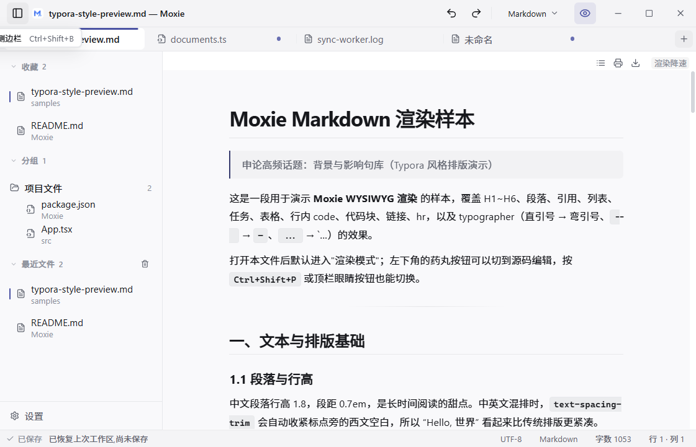<br>*03 · Tooltip* | 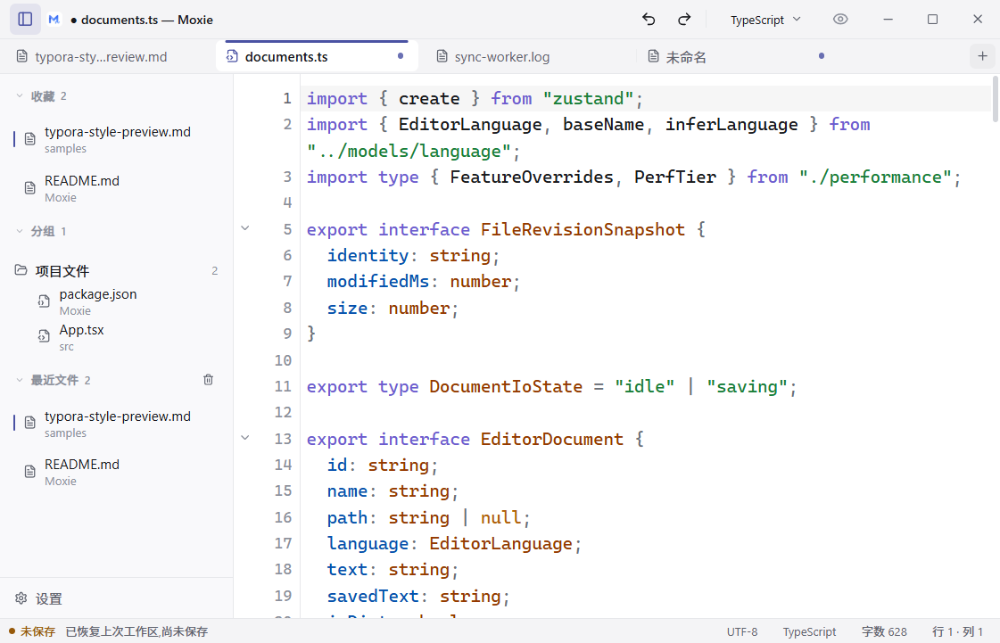<br>*04 · 代码文件* |
| 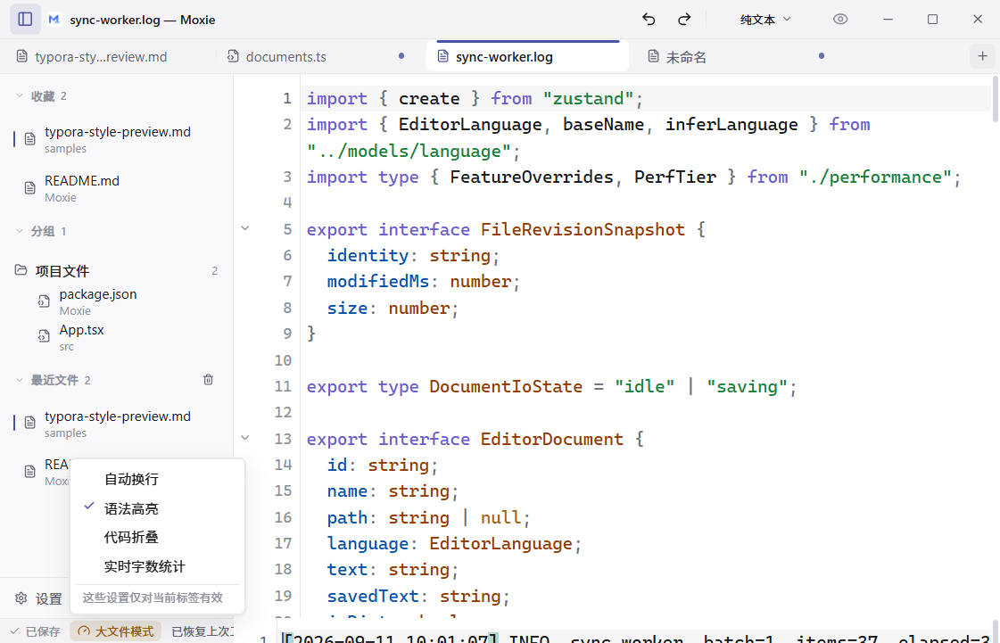<br>*05 · 大文件模式弹层* | 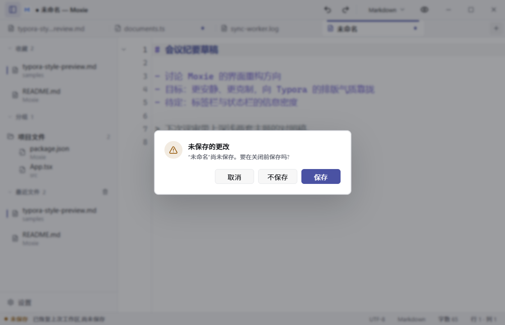<br>*06 · 保存确认对话框* |
| <br>*07 · 源码模式* | 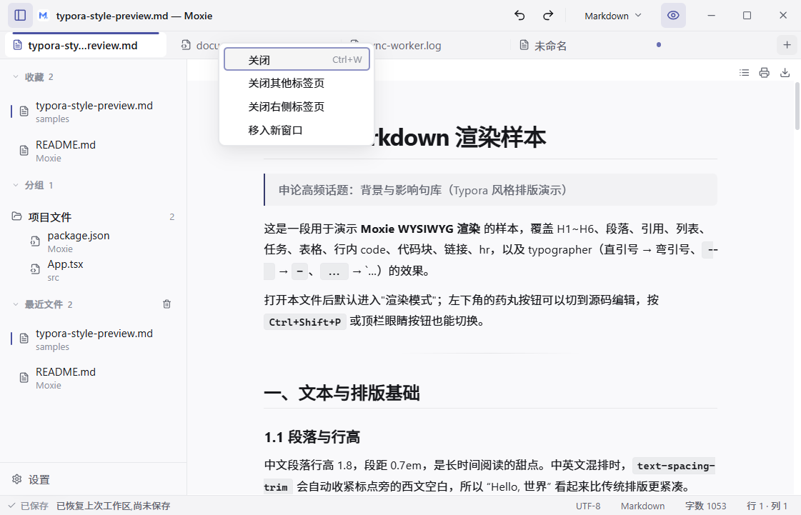<br>*08 · 标签右键菜单* |
| <br>*09 · 语言菜单* | 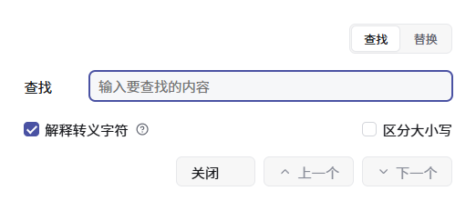<br>*10 · 查找替换窗口* |
| <br>*11 · 设置窗口* | 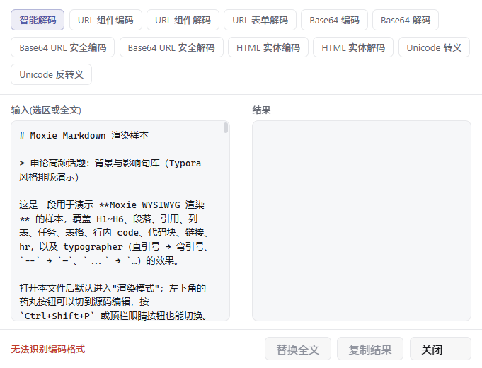<br>*12 · 编码转换窗口* |

**深色**

| | |
|---|---|
| 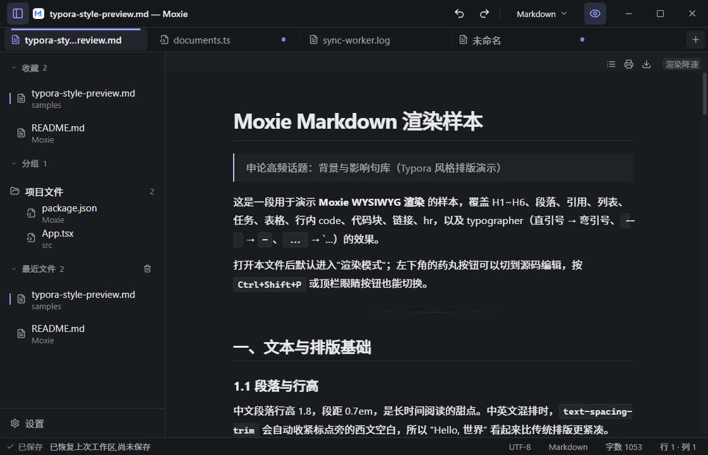<br>*13 · 主窗口 · 渲染模式* | 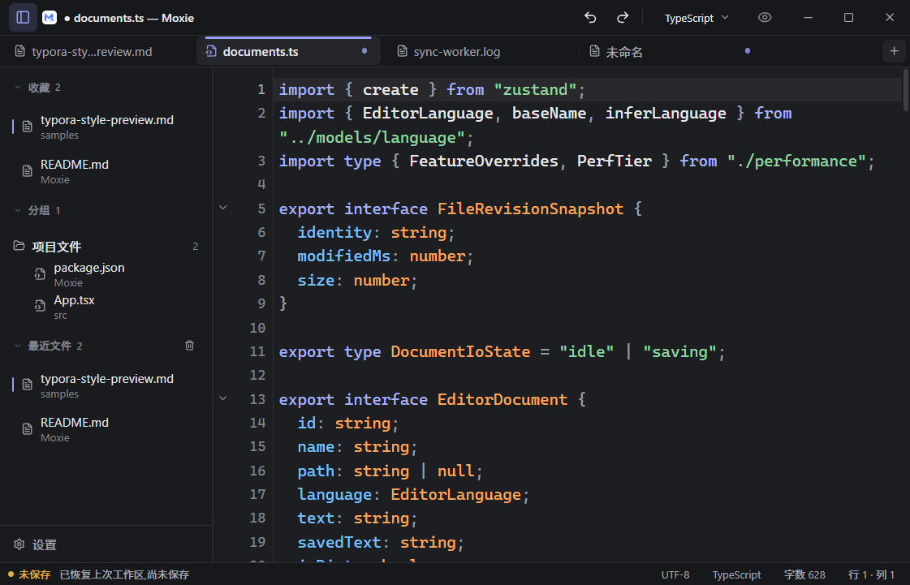<br>*14 · 代码文件* |
| 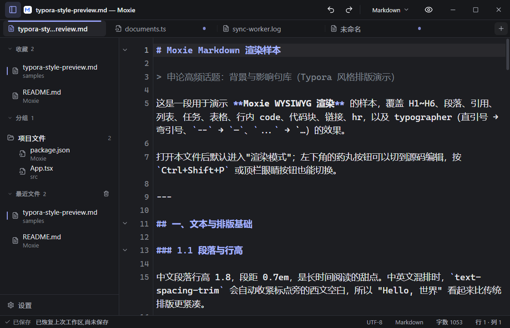<br>*15 · 源码模式* | 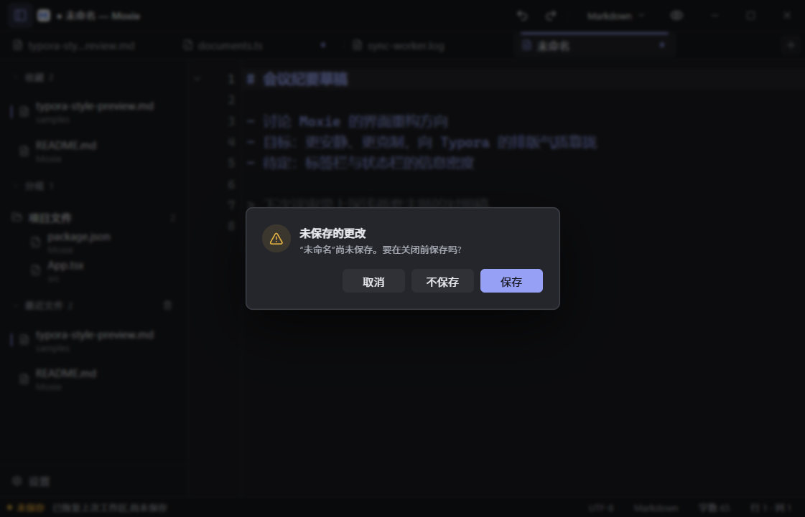<br>*16 · 保存确认对话框* |
| 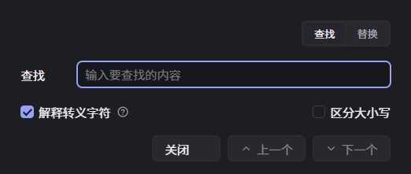<br>*17 · 查找替换窗口* | 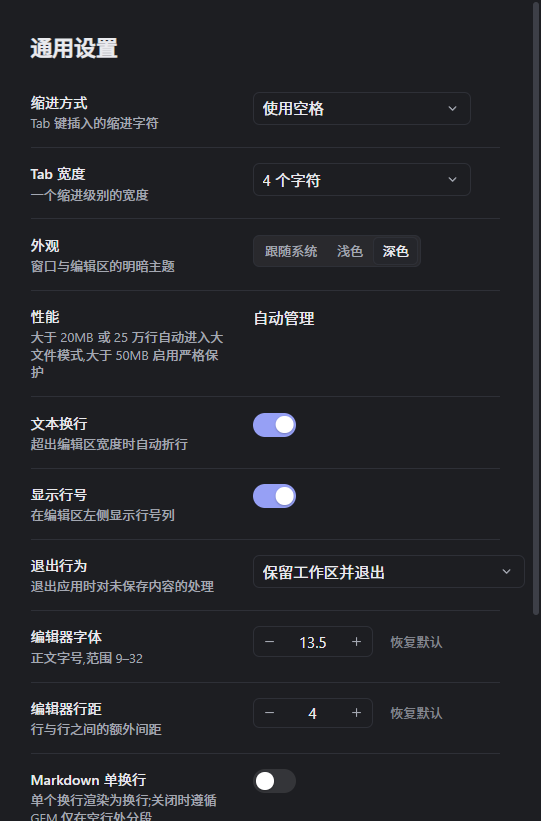<br>*18 · 设置窗口* |

---

## 附：证据文件

- 截图：`docs/ui-redesign/` 共 18 张（浅色 12 · 深色 6，含空状态、主窗口五种状态、菜单、Tooltip、对话框与三个独立窗口）
- 度量：`docs/ui-redesign/measure-light.json`、`measure-dark.json`（含主窗口 39 个选择器、三个独立窗口、预览 iframe 内部的计算样式与对比度）
- 采集工具：`docs/ui-redesign/tools/{seed,capture,measure}.mjs`（Node + CDP 驱动，可复现）
- 采集方法：`MOXIE_DATA_DIR=<临时目录>` + `WEBVIEW2_ADDITIONAL_BROWSER_ARGUMENTS=--remote-debugging-port=9222` 启动应用，再用 CDP 注入状态、截图与度量；`seed.mjs` 负责构造工作区快照（含最近文件、大文件、脏文档）
